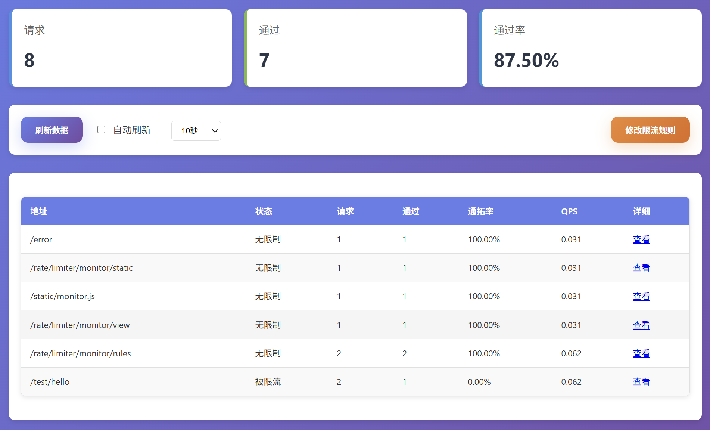
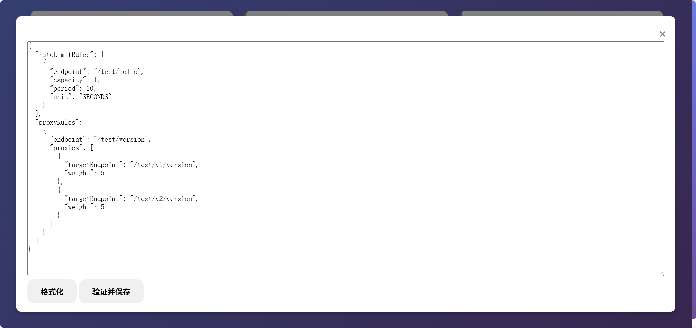

# Rate Limiter 限流器

> 一个基于Spring Boot的限流组件，支持本地限流和Redis分布式限流，提供了灵活的配置选项和监控功能。

[](https://jitpack.io/#com.gitee.wb04307201/rate-limiter)
[](https://gitee.com/wb04307201/rate-limiter)
[](https://gitee.com/wb04307201/rate-limiter)
[](https://github.com/wb04307201/rate-limiter)
[](https://github.com/wb04307201/rate-limiter)  
  

## 功能特性

- 支持本地限流（基于Guava RateLimiter）
- 支持Redis分布式限流（基于Redisson）
- 支持多种Redis部署模式（单机、集群、哨兵）
- 灵活的限流规则配置
- 实时监控和统计功能

## 增加 JitPack 仓库
```xml
<repositories>
    <repository>
        <id>jitpack.io</id>
        <url>https://jitpack.io</url>
    </repository>
</repositories>
```

## 引入jar
```xml
<dependency>
    <groupId>com.gitee.wb04307201.rate-limiter</groupId>
    <artifactId>rate-limiter-spring-boot-starter</artifactId>
    <version>1.0.3</version>
</dependency>
```

## 配置限流参数

### 使用单机限流

```yaml
rate:
  limiter:
    rate-limiting-type: standalone # 限流类型: redis单点 redis, redis集群 redis-cluster, redis哨兵 redis-sentinel, 单机 standalone(默认)
    rules:                         # 限流规则列表
      - endpoint: /api/test        # 接口路径
        limit: 10                  # 限流数量
        window: 60                 # 时间窗口(秒)
```

### 配置项说明

| 配置项                               | 类型      | 说明                                                             |
|-----------------------------------|---------|----------------------------------------------------------------|
| `rate.limiter.rate-limiting-type` | String  | 限流类型: `standalone`, `redis`, `redis-cluster`, `redis-sentinel` |
| `rate.limiter.rules`              | List    | 限流规则列表                                                         |
| `rate.limiter.rules[i].endpoint`  | String  | 需要限流的端点（支持Ant风格路径匹配）                                           |
| `rate.limiter.rules[i].capacity`  | Integer | 单位时间内的请求数量上限                                                   |
| `rate.limiter.rules[i].period`    | Integer | 时间周期（秒）                                                        |

### 使用Redis分布式限流

如果需要使用Redis分布式限流，配置如下：

```yaml
rate:
  limiter:
    rate-limiting-type: redis
    attributes:
      address: redis://localhost:6379
      password: your_password
      database: 0
    rules:
      - endpoint: /api/test/**
        capacity: 10
        period: 1
```

#### Redis相关配置项说明
| 配置项                                   | 类型           | 说明                                                           |
|---------------------------------------|--------------|--------------------------------------------------------------|
| `rate.limiter.rate-limiting-type`     | String       | redis单点 redis, redis集群 redis-cluster, redis哨兵 redis-sentinel |
| `rate.limiter.attributes.address`     | String       | Redis地址（单机模式）                                                |
| `rate.limiter.attributes.nodes`       | List<String> | Redis节点地址（集群/哨兵模式）                                           |
| `rate.limiter.attributes.password`    | String       | Redis密码                                                      |
| `rate.limiter.attributes.database`    | Integer      | Redis数据库索引（默认0）                                              |
| `rate.limiter.attributes.master-name` | String       | 哨兵模式下的主节点名称                                                  |


## 监控功能

项目提供了内置的监控页面，可以查看限流统计信息：

- 访问 `/rate/limiter/monitor/view` 查看监控页面



## 扩展性

项目设计具有良好的扩展性：

1. 可以通过实现[IFactory](rate-limiter\src\main\java\cn\wubo\rate\limiter\factory\IFactory.java#L6-L11)接口添加新的存储方式
2. 可以通过实现[IRateLimiter](rate-limiter\src\main\java\cn\wubo\rate\limiter\bucket\IRateLimiter.java#L3-L9)接口添加新的限流算法
3. 可以通过实现 [IStorage](rate-limiter\src\main\java\cn\wubo\rate\limiter\storage\IStorage.java#L4-L9) 接口来自定义存储

