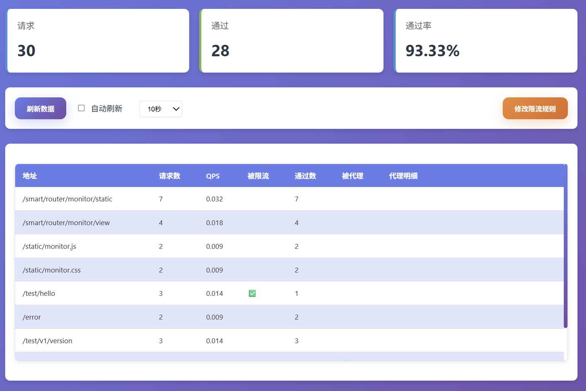

# Rate Limiter 限流器

> 一个基于Spring Boot的限流组件。

[](https://jitpack.io/#com.gitee.wb04307201/rate-limiter)
[](https://gitee.com/wb04307201/rate-limiter)
[](https://gitee.com/wb04307201/rate-limiter)
[](https://github.com/wb04307201/rate-limiter)
[](https://github.com/wb04307201/rate-limiter)  
  

## 功能特性

- 支持令牌桶算法
- 支持多种存储方式（单机版、Redis版）
- 提供Web监控界面
- 提供监控页面查看限流统计信息

## 增加 JitPack 仓库
```xml
<repositories>
    <repository>
        <id>jitpack.io</id>
        <url>https://jitpack.io</url>
    </repository>
</repositories>
```

## 引入jar
```xml
<dependency>
    <groupId>com.gitee.wb04307201.rate-limiter</groupId>
    <artifactId>rate-limiter-spring-boot-starter</artifactId>
    <version>1.0.2</version>
</dependency>
```

## 配置限流参数
```yaml
rate:
  limiter:
    rate-limiting-type: standalone # 限流类型: standalone(单机), redis(Redis)
    rules:                         # 限流规则列表
      - endpoint: /api/test        # 接口路径
        limit: 10                  # 限流数量
        window: 60                 # 时间窗口(秒)
```

## 监控页面

访问路径: `/rate/limiter/monitor/view`


## 扩展性

项目设计具有良好的扩展性：

1. 可以通过实现[IFactory](rate-limiter\src\main\java\cn\wubo\rate\limiter\factory\IFactory.java#L6-L11)接口添加新的存储方式
2. 可以通过实现[IRateLimiter](rate-limiter\src\main\java\cn\wubo\rate\limiter\bucket\IRateLimiter.java#L3-L9)接口添加新的限流算法

