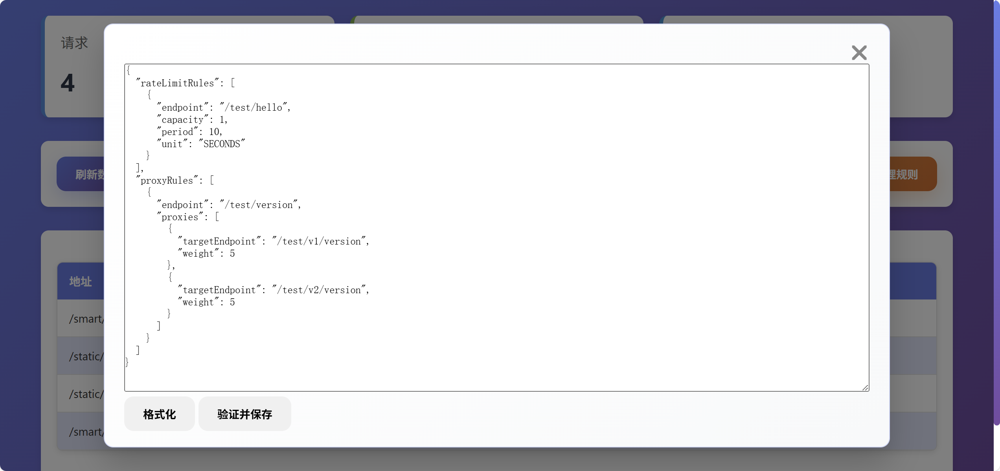

# Smart Router 巧路由

> 一个基于Spring Boot的智能路由和限流组件，支持多种限流策略和路由规则管理，实现简单的灰度发布。

[](https://jitpack.io/#com.gitee.wb04307201/smart-router)
[](https://gitee.com/wb04307201/smart-router)
[](https://gitee.com/wb04307201/smart-router)
[](https://github.com/wb04307201/smart-router)
[](https://github.com/wb04307201/smart-router)  
  

## 功能特性

- 多种限流算法支持：
    - Google Guava 令牌桶算法
    - Redisson 分布式限流
- 多种Redis部署模式支持：
    - 单节点Redis
    - Redis集群模式
    - Redis哨兵模式
- 动态路由规则管理
- 实时监控面板
- 基于注解的限流配置
- Spring Boot自动配置

## 增加 JitPack 仓库
```xml
<repositories>
    <repository>
        <id>jitpack.io</id>
        <url>https://jitpack.io</url>
    </repository>
</repositories>
```

## 引入jar
```xml
<dependency>
    <groupId>com.gitee.wb04307201.smart-router</groupId>
    <artifactId>smart-router-spring-boot-starter</artifactId>
    <version>1.0.4</version>
</dependency>
```

## 基础配置结构

```yaml
smart-router:
  rateLimiter:
    rateLimitingType: standalone # 限流类型：standalone、redis、redis-cluster、redis-sentinel
  rateLimitRules:                # 限流规则列表
    - endpoint: /api/test        # 接口路径
      capacity: 100              # 容量/令牌数
      period: 60                 # 时间周期
      unit: SECONDS              # 时间单位（可选，默认SECONDS）
  proxyRules:                    # 代理规则列表
    - endpoint: /api/proxy       # 代理路径
      proxies:                   # 目标代理列表
        - targetEndpoint: /api/v1/test  # 目标路径
          weight: 5              # 权重
        - targetEndpoint: /api/v2/test
          weight: 5
```


## 限流类型配置

### 1. Standalone模式（本地限流）
```yaml
smart-router:
  rateLimiter:
    rateLimitingType: standalone
```


### 2. Redis模式
```yaml
smart-router:
  rateLimiter:
    rateLimitingType: redis
    attributes:
      address: localhost:6379    # Redis地址
      password: your_password     # Redis密码
      database: 0                # 数据库索引(0-15)
```


### 3. Redis Cluster模式
```yaml
smart-router:
  rateLimiter:
    rateLimitingType: redis-cluster
    attributes:
      nodes:                    # 集群节点列表
        - localhost:7000
        - localhost:7001
      password: your_password    # 密码
```


### 4. Redis Sentinel模式
```yaml
smart-router:
  rateLimiter:
    rateLimitingType: redis-sentinel
    attributes:
      nodes:                    # Sentinel节点列表
        - localhost:26379
        - localhost:26380
      password: your_password    # 密码
      masterName: mymaster       # 主节点名称
```


## 完整配置示例

```yaml
smart-router:
  # 限流规则
  rateLimitRules:
    - endpoint: /test/hello
      capacity: 1     # 每10秒只允许1个请求
      period: 10
      unit: SECONDS   # 时间单位（可选）
  
  # 代理规则
  proxyRules:
    - endpoint: /test/version
      proxies:
        - targetEndpoint: /test/v1/version
          weight: 5    # 50%流量
        - targetEndpoint: /test/v2/version
          weight: 5    # 50%流量
          
  # Redis相关配置（根据使用的限流类型选择）
  rateLimiter:
    # 限流类型
    rateLimitingType: redis
    attributes:
      # Redis单机配置
      address: localhost:6379
      password: password
      database: 0
      
      # 或Redis Cluster配置
      # nodes:
      #   - localhost:7000
      #   - localhost:7001
      # password: password
      
      # 或Redis Sentinel配置
      # nodes:
      #   - localhost:26379
      #   - localhost:26380
      # password: password
      # masterName: mymaster
```

## 监控功能

项目提供了内置的监控页面，访问 `/smart/router/monitor/view` 查看监控页面




## 扩展性

项目设计具有良好的扩展性：
1. 可以通过实现[IFactory.java](smart-router/src/main/java/cn/wubo/smart/router/factory/IFactory.java)接口添加新的存储方式
2. 可以通过实现[IRateLimiter.java](smart-router/src/main/java/cn/wubo/smart/router/bucket/IRateLimiter.java)接口添加新的限流算法
3. 可以通过实现接口[IStorage.java](smart-router/src/main/java/cn/wubo/smart/router/storage/IStorage.java)来自定义存储

