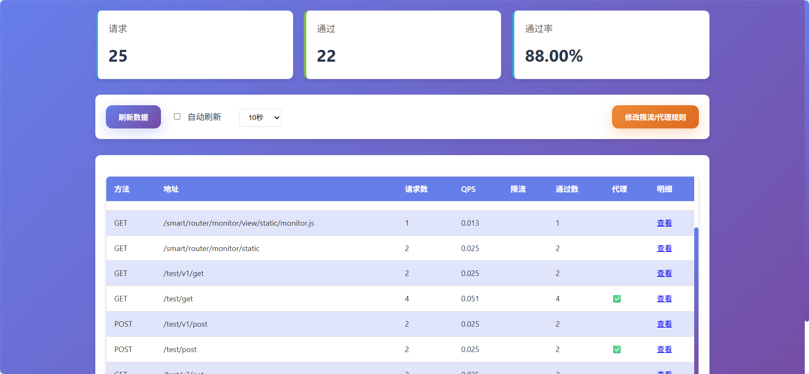
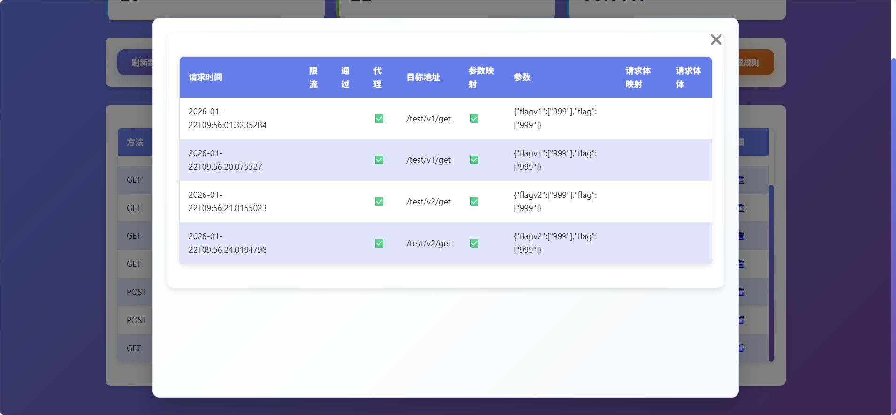
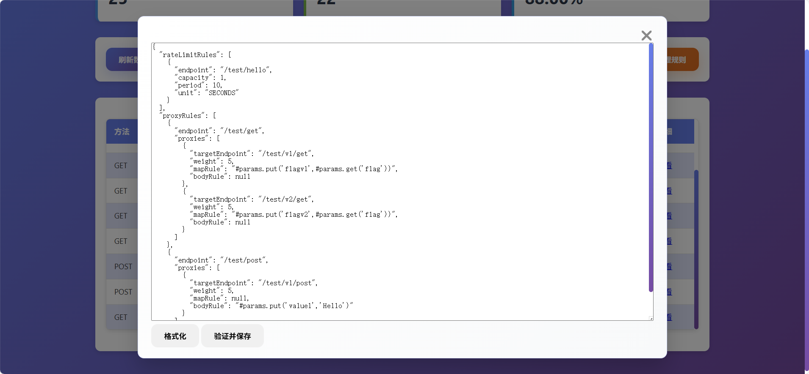

# Smart Router 巧路由

<div align="right">
  <a href="README.md">English</a> | 中文
</div>

> 一个Spring Boot的应用内根据rest请求路径限流、路径代理组件。

[](https://jitpack.io/#com.gitee.wb04307201/smart-router)
[](https://gitee.com/wb04307201/smart-router)
[](https://gitee.com/wb04307201/smart-router)
[](https://github.com/wb04307201/smart-router)
[](https://github.com/wb04307201/smart-router)  
  

## 功能特性

- 多种限流算法支持：
    - Google Guava 令牌桶算法
    - Redisson 分布式限流
- 多种Redis部署模式支持：
    - 单节点Redis
    - Redis集群模式
    - Redis哨兵模式
- 路径代理规则支持
    - 随机权重路由
    - SpEL表达式参数修改
    - SpEL表达式请求体修改
- 动态路由规则管理
- 实时监控面板

## 增加 JitPack 仓库
```xml
<repositories>
    <repository>
        <id>jitpack.io</id>
        <url>https://jitpack.io</url>
    </repository>
</repositories>
```

## 引入jar
```xml
<dependency>
    <groupId>com.gitee.wb04307201.smart-router</groupId>
    <artifactId>smart-router-spring-boot-starter</artifactId>
    <version>1.0.6</version>
</dependency>
```

## 基础配置结构

```yaml
smart-router:
  rateLimiter:
    rateLimitingType: standalone                      # 限流类型：standalone、redis、redis-cluster、redis-sentinel
    rateLimitRules:                                   # 限流规则列表
      - endpoint: /test/hello                         # 限流路径
        capacity: 1                                   # 容量/令牌数
        period: 10                                    # 时间周期
        unit: SECONDS                                 # 时间单位（可选，默认SECONDS）
  proxyRules:                                         # 代理规则列表
    - endpoint: /test/get                             # 代理路径
      proxies:                                        # 代理目标列表
        - targetEndpoint: /test/v1/get                # 目标路径
          weight: 5                                   # 权重
                                                      # 参数映射
          mapRule: |-
            #params.put('flagv1',#params.get('flag'))
        - targetEndpoint: /test/v2/get
          weight: 5
          mapRule: |-
            #params.put('flagv2',#params.get('flag'))
    - endpoint: /test/post
      proxies:
        - targetEndpoint: /test/v1/post
          weight: 5
                                                        # 请求体映射
          bodyRule: |-
            #params.put('value1','Hello')
```

## 限流类型配置

### 1. Standalone模式（本地限流）
```yaml
smart-router:
  rateLimiter:
    rateLimitingType: standalone
```


### 2. Redis模式
```yaml
smart-router:
  rateLimiter:
    rateLimitingType: redis
    attributes:
      address: localhost:6379    # Redis地址
      password: your_password     # Redis密码
      database: 0                # 数据库索引(0-15)
```


### 3. Redis Cluster模式
```yaml
smart-router:
  rateLimiter:
    rateLimitingType: redis-cluster
    attributes:
      nodes:                    # 集群节点列表
        - localhost:7000
        - localhost:7001
      password: your_password    # 密码
```


### 4. Redis Sentinel模式
```yaml
smart-router:
  rateLimiter:
    rateLimitingType: redis-sentinel
    attributes:
      nodes:                    # Sentinel节点列表
        - localhost:26379
        - localhost:26380
      password: your_password    # 密码
      masterName: mymaster       # 主节点名称
```

## 运行时动态修改限流、代理配置
获取当前限流、代理配置
```http request
GET http://localhost:8080/smart/router/monitor/rules
Accept: application/json
```

```json
{
    "rateLimitRules": [  //限流规则
        {
            "endpoint": "/test/hello",
            "capacity": 1,
            "period": 10,
            "unit": "SECONDS"
        }
    ],
    "proxyRules": [  //代理规则
        {
            "endpoint": "/test/get",
            "proxies": [
                {
                    "targetEndpoint": "/test/v1/get",
                    "weight": 5,
                    "mapRule": "#params.put('flagv1',#params.get('flag'))",
                    "bodyRule": null
                },
                {
                    "targetEndpoint": "/test/v2/get",
                    "weight": 5,
                    "mapRule": "#params.put('flagv2',#params.get('flag'))",
                    "bodyRule": null
                }
            ]
        },
        {
            "endpoint": "/test/post",
            "proxies": [
                {
                    "targetEndpoint": "/test/v1/post",
                    "weight": 10,
                    "mapRule": null,
                    "bodyRule": "#params.put('value1','Hello')"
                }
            ]
        }
    ]
}
```

## 监控页面

项目提供了内置的监控页面，访问 `/smart/router/monitor/view` 查看监控页面



可以在页面中查看、调整限流配置、代理配置



## 扩展性

项目设计具有良好的扩展性：
1. 可以通过实现[IFactory.java](smart-router/src/main/java/cn/wubo/smart/router/factory/IFactory.java)和[IRateLimiter.java](smart-router/src/main/java/cn/wubo/smart/router/bucket/IRateLimiter.java)接口添加新的限流算法 
2. 可以通过实现接口[IStorage.java](smart-router/src/main/java/cn/wubo/smart/router/storage/IStorage.java)来自定义存储

